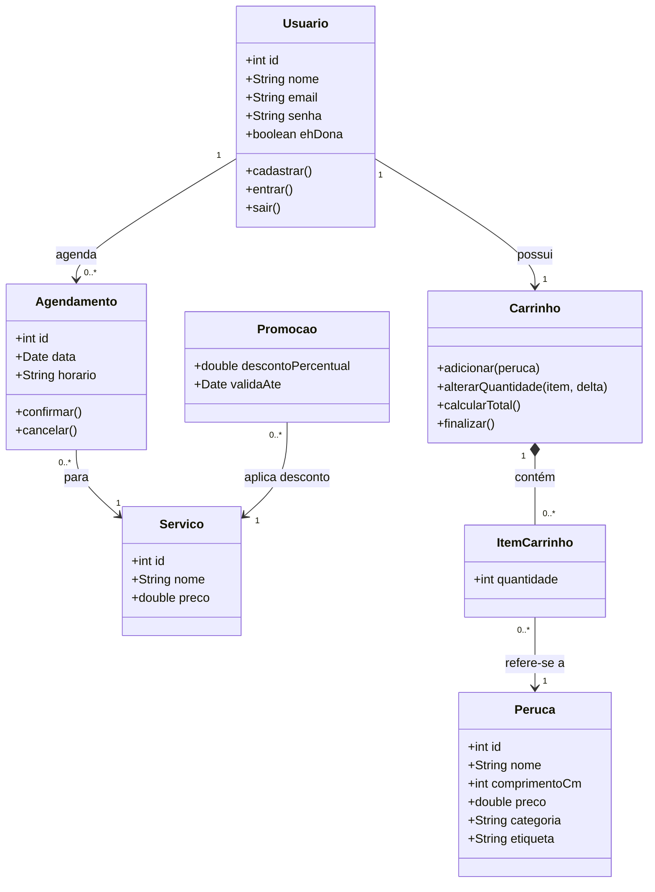

# Diagrama de classes – LUMORA

```mermaid
classDiagram
  class Usuario {
    +int id
    +String nome
    +String email
    +String senha
    +boolean ehDona
    +cadastrar()
    +entrar()
    +sair()
  }
  class Servico {
    +int id
    +String nome
    +double preco
  }
  class Agendamento {
    +int id
    +Date data
    +String horario
    +confirmar()
    +cancelar()
  }
  class Peruca {
    +int id
    +String nome
    +int comprimentoCm
    +double preco
    +String categoria
    +String etiqueta
  }
  class Carrinho {
    +adicionar(peruca)
    +alterarQuantidade(item, delta)
    +calcularTotal()
    +finalizar()
  }
  class ItemCarrinho {
    +int quantidade
  }
  class Promocao {
    +double descontoPercentual
    +Date validaAte
  }

  Usuario "1" --> "0..*" Agendamento : agenda
  Agendamento "0..*" --> "1" Servico : para
  Usuario "1" --> "1" Carrinho : possui
  Carrinho "1" *-- "0..*" ItemCarrinho : contém
  ItemCarrinho "0..*" --> "1" Peruca : refere-se a
  Promocao "0..*" --> "1" Servico : aplica desconto
```
