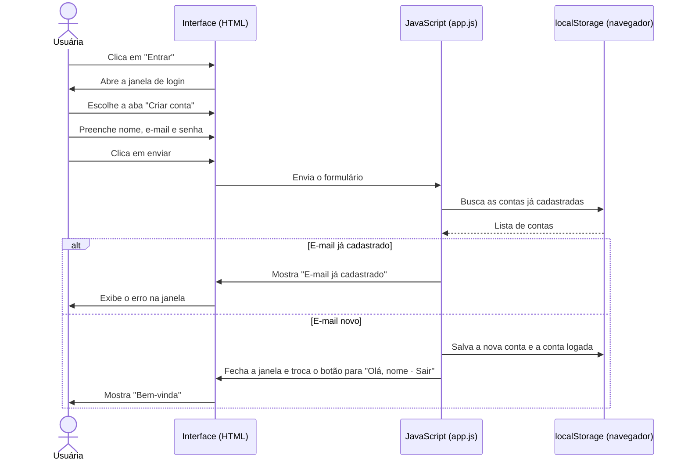

# Diagrama de sequência – criação de conta

Mostra, passo a passo, o que acontece quando alguém cria uma conta no protótipo.

```mermaid
sequenceDiagram
  actor U as Usuária
  participant I as Interface (HTML)
  participant J as JavaScript (app.js)
  participant L as localStorage (navegador)
  U->>I: Clica em "Entrar"
  I->>U: Abre a janela de login
  U->>I: Escolhe a aba "Criar conta"
  U->>I: Preenche nome, e-mail e senha
  U->>I: Clica em enviar
  I->>J: Envia o formulário
  J->>L: Busca as contas já cadastradas
  L-->>J: Lista de contas
  alt E-mail já cadastrado
    J->>I: Mostra "E-mail já cadastrado"
    I->>U: Exibe o erro na janela
  else E-mail novo
    J->>L: Salva a nova conta e a conta logada
    J->>I: Fecha a janela e troca o botão para "Olá, nome · Sair"
    I->>U: Mostra "Bem-vinda"
  end
```
