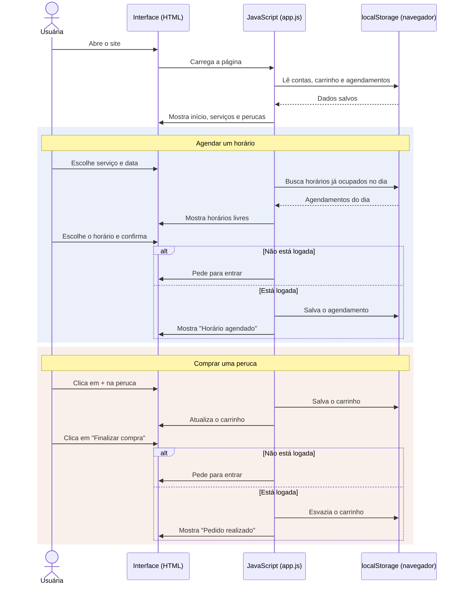

# Diagrama de sequência – fluxo geral

Mostra como a interface, o JavaScript e o armazenamento do navegador conversam ao agendar um horário e ao comprar uma peruca.

```mermaid
sequenceDiagram
  actor U as Usuária
  participant I as Interface (HTML)
  participant J as JavaScript (app.js)
  participant L as localStorage (navegador)
  U->>I: Abre o site
  I->>J: Carrega a página
  J->>L: Lê contas, carrinho e agendamentos
  L-->>J: Dados salvos
  J->>I: Mostra início, serviços e perucas
  rect rgb(235, 240, 250)
    Note over U,L: Agendar um horário
    U->>I: Escolhe serviço e data
    J->>L: Busca horários já ocupados no dia
    L-->>J: Agendamentos do dia
    J->>I: Mostra horários livres
    U->>I: Escolhe o horário e confirma
    alt Não está logada
      J->>I: Pede para entrar
    else Está logada
      J->>L: Salva o agendamento
      J->>I: Mostra "Horário agendado"
    end
  end
  rect rgb(250, 240, 235)
    Note over U,L: Comprar uma peruca
    U->>I: Clica em + na peruca
    J->>L: Salva o carrinho
    J->>I: Atualiza o carrinho
    U->>I: Clica em "Finalizar compra"
    alt Não está logada
      J->>I: Pede para entrar
    else Está logada
      J->>L: Esvazia o carrinho
      J->>I: Mostra "Pedido realizado"
    end
  end
```
